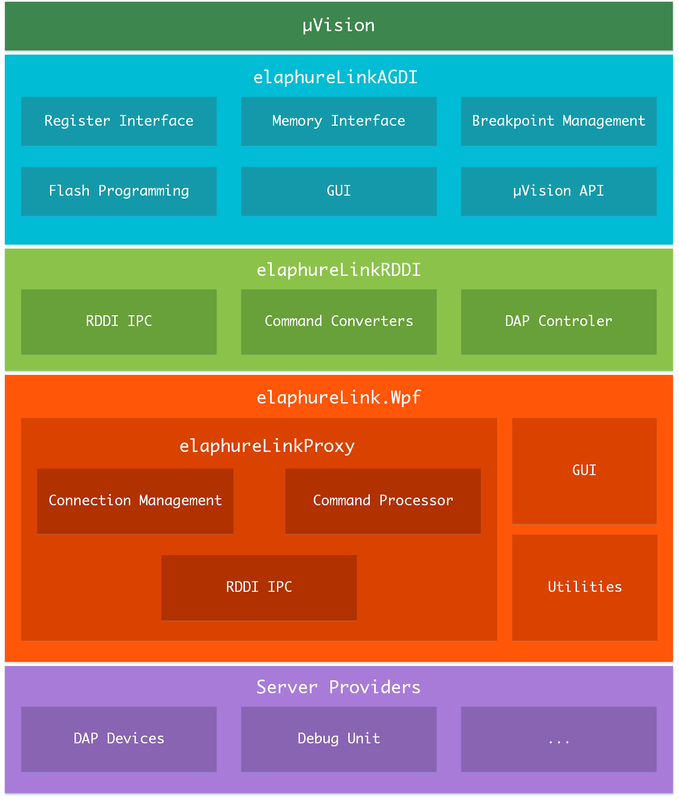

<h1 align="center">elaphureLink</h1>

[![Build status][github-action-build-image]][github-action-build-url] [![license][license-image]][license-url]

[github-action-build-image]: https://github.com/windowsair/elaphureLink/actions/workflows/build-binary.yml/badge.svg
[github-action-build-url]: https://github.com/windowsair/elaphureLink/actions/workflows/build-binary.yml

[license-image]: https://img.shields.io/badge/license-BSD2-green.svg
[license-url]: https://github.com/windowsair/elaphureLink/blob/master/LICENSE.md

elaphureLink is a CMSIS-DAP compliant debugger solution for Arm® Keil® µVision® IDE that provides conversion between TCP/IP and DAP.

## Features

- Easy to use.
- Support for custom debug hardware implementation.
- Debug port support
    - [x] SWD
    - [x] JTAG
- Debug spec support
  - [x] ADIv5

## Quick Start

This video shows how to install the driver, connect to the DAP device and perform the flash program.

https://user-images.githubusercontent.com/17078589/183233113-5dcac5f6-47d6-4d45-a231-12698253b3e2.mp4

## System Requirements

- Supported OS: Windows 7 or later.
- Supported Platforms: x86-64(AMD64).
- Additional requirements
  - [.Net Framework 4.7.2](https://dotnet.microsoft.com/en-us/download/dotnet-framework/net472) (For elaphureLink.Wpf).
- µVision tested version
  - [x] v5.12.0.0
  - [x] v5.16a
  - [x] v5.25.2.0
  - [x] v5.31.0.0
  - [x] v5.37.0.0

> Due to the large number of versions, only some versions of µVision were tested.

## Download and Installation

The required dependencies are already packaged in the elaphureLink.Wpf project to provide the end user with an out-of-the-box experience.

- **Stable Version**

Stable and pre-release versions are available in [Releases](https://github.com/windowsair/elaphureLink/releases).

- **Develop Version**

You can download the latest build in Github Action at [build-binary](https://github.com/windowsair/elaphureLink/actions/workflows/build-binary.yml).

- **Update**

You can check and update the latest stable version in the Info Page of elaphureLink.Wpf.

> At present, only the distribution of portable versions is available for download. All you need to do is extract and run `elaphureLink.Wpf.exe`

## Application case

- [wireless-esp8266-dap](https://github.com/windowsair/wireless-esp8266-dap) Single board wireless debugger based on ESP8266.

> Do you want to add a new case? Start a new pull request or issue!

----

## Develop

This section will introduce the relevant content in development.

### Build

Visual Studio 2019 or later version is recommended for building. Currently, you can only build the `elaphure.Wpf` project, and other dependencies will be built automatically.

### Architecture

The following diagram shows the system architecture of elaphureLink.

elaphureLink consists of the following 5 main components:

- `AGDI` elaphureLinkAGDI is application generic debug interface of elaphureLink. It is the bridge between Arm Keil µVision and RDDI connection. It performs the interface to all basic debugger features, allows complex breakpoints, flash programming or access to system memory. Some of the debug settings and GUI in µVision are also provided by it.

- `RDDI` elaphureLinkRDDI is remote device debug interface of elaphureLink that allow remote DAP device communicate with the debug interface. It converts the requests into standard CMSIS-DAP commands and communicates with the proxy.

- `Proxy` elaphureLinkProxy play the role of communicating with the debug unit. It exports some API for connection management. Developers can use these API to build specific applications.

- `Wpf` elaphureLink.Wpf is a simple GUI wrapper of elaphureLinkProxy. It provides a number of utilities for managing drivers and connection control.

- `Server Providers` It may be the various devices containing the CMSIS-DAP implementation to provide debugging capabilities. For more examples, see [Application case](#Application-case).

### Server Providers Document

The most common development requirement is to build your own server provider. A server provider is often a DAP probe. Specific information can be found in the [Server Providers Document](docs/server_providers_document.md).

### Proxy Document

During each connection, a specific protocol needs to be followed between elaphureLinkProxy and debug unit. For more information about the protocol, see [proxy_protocol](docs/proxy_protocol.md).

You may want to build your own application using elaphureLinkProxy, in this case please refer to the Proxy API, available at [Proxy API](docs/proxy_api.md).

## Credit

[@Mouri_Naruto](https://github.com/MouriNaruto) He provided unique insights into Windows programming for this project.

## License

[elaphureLink License](License.md)
